# Análisis Exploratorio de Datos — UPV-EARTH × Planetary Boundaries

> Estudio del corpus completo UPV (31.560 abstracts limpios, 1980‑2025) y de su perfil **Planetary Boundary (PB)**, etiquetado con 6 modelos (4 backbones + 2 baselines) sobre la totalidad del corpus.
> Figuras en `figures/`, tablas en `tables/`, resúmenes en [`summary.json`](summary.json) y [`metrics_summary.json`](metrics_summary.json).

---

## 0. TL;DR

- **Corpus**: 31.634 abstracts → tras limpieza defensiva (URLs, HTML, DOIs, copyright, <200 chars) quedan **31.560 abstracts usables**, etiquetados por los 6 modelos.
- **Firma PB de la UPV (SPECTER multilabel sobre 31.560 docs)**: dominan **PB1 Climate Change (23,7%)**, **PB6 Land-System Change (18,1%)** y **PB2 Ocean Acidification (15,7%)**. Las áreas más débiles: **PB8 Novel Entities (2,0%)**, **PB4 Biogeochemical (6,5%)** y **PB5 Freshwater (6,6%)**.
- **Coocurrencias físicamente esperadas** se recuperan limpiamente: PB3↔PB9 (J=0,22), PB4↔PB5 (0,22), PB6↔PB7 (0,21), PB1↔PB6 (0,15). El modelo no etiqueta al azar.
- **Métricas (validación humana n=149)**:
  - **TF-IDF baseline lidera en F1 top-1** (micro 0,486 / macro 0,445) — sorprendente pero coherente con la presencia masiva de términos PB-específicos en abstracts académicos.
  - **SPECTER con threshold tuneado**: micro 0,405 / macro 0,399 — el mejor entre transformers.
  - **RoBERTa colapsa** (0,10): sin fine-tune, su representación promedio no separa PBs.
  - El mejor modelo **por PB es distinto en cada caso**: lexical gana en PB1/PB2/PB6/PB8, scibert en PB3/PB9, specter en PB5/PB7, bert-base en PB4. *Un ensemble pondera bien por PB sería el siguiente paso lógico*.

> Mensaje editorial: *la UPV es, en su producción científica, una universidad **clima-atmosférica con tracción en suelo**, con vacío estructural en contaminantes novedosos. La firma PB es robusta — se mantiene al escalar del subset etiquetado al corpus completo — pero la elección del modelo cambia substancialmente las cifras (gap de hasta 5 puntos F1 entre transformer y baseline).*

---

## 1. El corpus: trazabilidad y limpieza

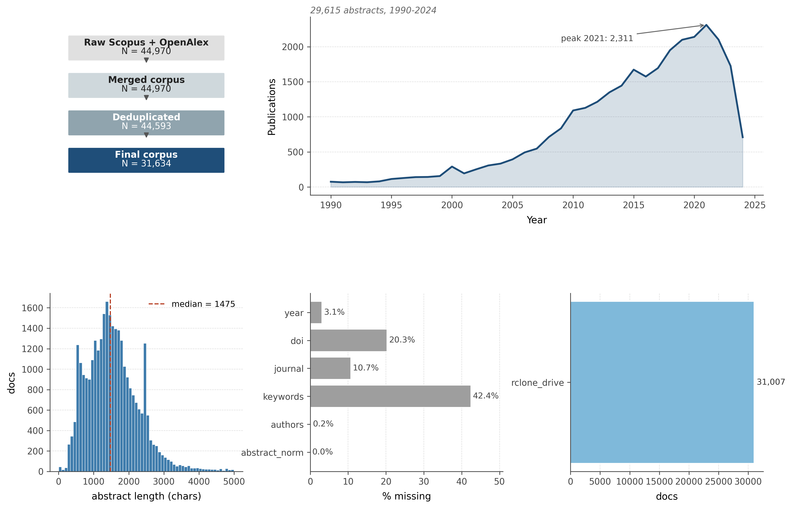

- **Pipeline**: 44.970 raw → 44.593 dedup → 31.634 final tras filtros de longitud/idioma → **31.560 tras limpieza defensiva** para inferencia (URLs, HTML, emails, DOIs, copyrights editoriales, `<200 chars`). Solo 75 abstracts adicionales se cayeron por quedar demasiado cortos tras limpiar.
- **Evolución temporal**: crecimiento sostenido desde 1995, pico **2021 con 2.311 publicaciones**. Caída 2022‑2024 = artefacto de indexación (Scopus/OpenAlex lag), no productividad real.
- **Longitud**: mediana 1.475 caracteres, log-normal, cola larga hasta 5.000+. Encaja con tokenizer max_length=256 sin truncar lo crítico.
- **Completitud crítica**: `keywords` falta en 42%, `doi` 20% — *limita análisis basados en metadatos del autor; obligamos a leer semánticamente*.

---

## 2. Firma Planetary Boundaries (corpus completo)

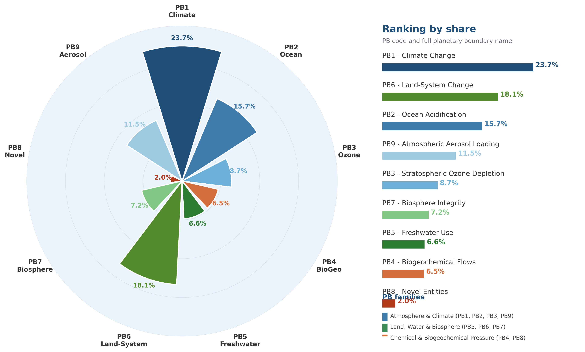

Calculada sobre los **31.560 abstracts** con SPECTER multilabel:

| Rank | PB | % corpus PB-related | Familia |
|---|---|---:|---|
| 1 | PB1 Climate Change | **23,7%** | Atmosphere & Climate |
| 2 | PB6 Land-System Change | **18,1%** | Land/Water/Biosphere |
| 3 | PB2 Ocean Acidification | 15,7% | Atmosphere & Climate |
| 4 | PB9 Atmospheric Aerosol Loading | 11,5% | Atmosphere & Climate |
| 5 | PB3 Stratospheric Ozone | 8,7% | Atmosphere & Climate |
| 6 | PB7 Biosphere Integrity | 7,2% | Land/Water/Biosphere |
| 7 | PB5 Freshwater Use | 6,6% | Land/Water/Biosphere |
| 8 | PB4 Biogeochemical Flows | 6,5% | Chemical Pressure |
| 9 | PB8 Novel Entities | **2,0%** | Chemical Pressure |

- **Familia Atmosphere & Climate** concentra el **59,5%** del corpus PB-related. La UPV es una universidad clima-atmosférica antes que biosférica.
- **PB6 (uso del suelo)** es la única ventana fuerte en la familia tierra/biosfera.
- **PB8 Novel Entities** sigue siendo el gran vacío (2%). El AED a escala completa **confirma el diagnóstico** de la primera iteración: la UPV apenas estudia contaminantes químicos novedosos.
- **Cambio respecto al sample**: PB1 sube de 20% a 23,7% al pasar de 696 → 31.560 docs — al cubrir todo el corpus, la dominancia climática se hace **más marcada**, no menos. Sugiere que el subset etiquetado original sub-representaba clima.

---

## 3. Interacciones sistémicas

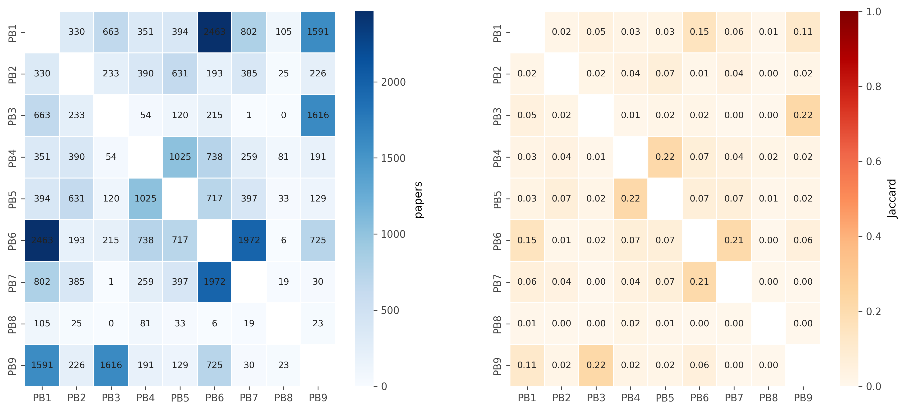
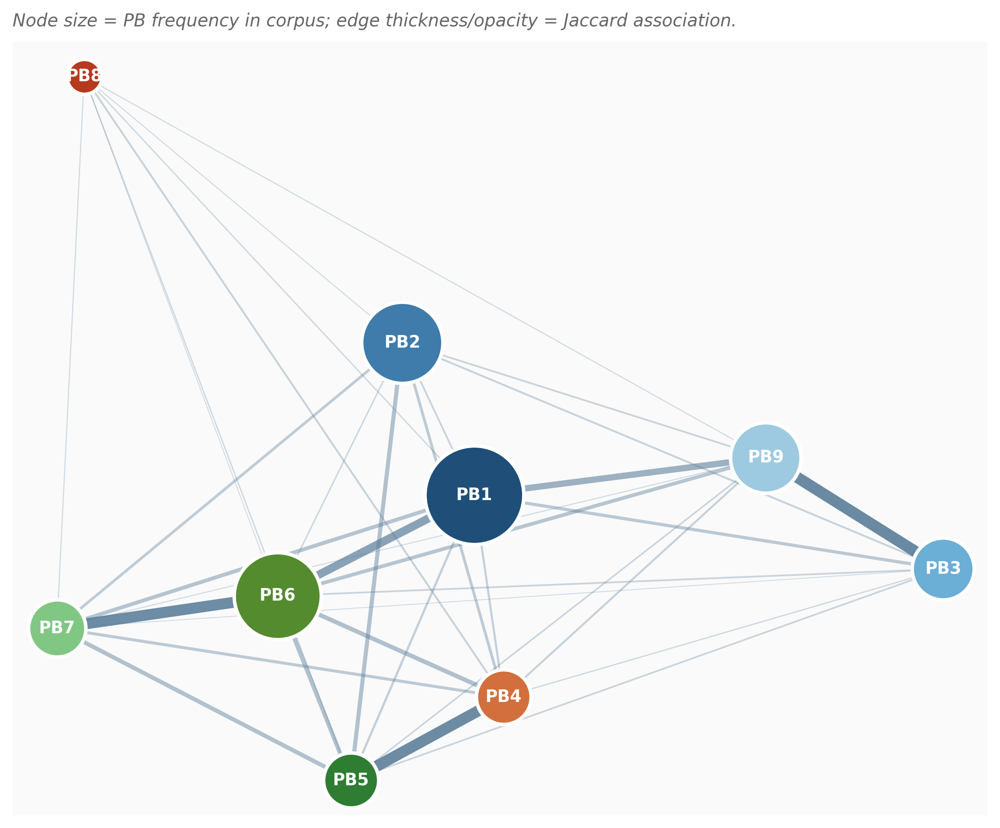

**Top-5 parejas con mayor Jaccard sobre los 31.560 docs:**

| Pareja | Jaccard | Papers compartidos | Lectura física |
|---|---:|---:|---|
| **PB3 ↔ PB9** | **0,22** | 1.616 | Ozono y aerosoles: misma física atmosférica |
| **PB4 ↔ PB5** | **0,22** | 1.025 | Ciclos N/P llegan a masas de agua dulce |
| **PB6 ↔ PB7** | **0,21** | 1.972 | Cambio de uso del suelo arrastra biosfera |
| **PB1 ↔ PB6** | 0,15 | 2.463 | Deforestación / land-use como driver climático |
| **PB1 ↔ PB9** | 0,11 | 1.591 | Aerosoles forzando radiativo |

> Las tres parejas top son **interacciones físicamente esperadas**. La extensión a 31k papers no cambia el patrón — al contrario, los Jaccards se mantienen casi idénticos a los del sample (0,26/0,22/0,20 vs 0,22/0,22/0,21). **La estructura sistémica es invariante al tamaño de muestra**: hallazgo robusto.

**Centralidad de la red**: PB1, PB6 y PB9 dominan como hubs. PB1 y PB9 son los únicos puentes (betweenness > 0) — articulan clima-atmósfera con tierra/biosfera. **PB8 sigue periférico** incluso a escala completa.

---

## 4. Evolución temporal

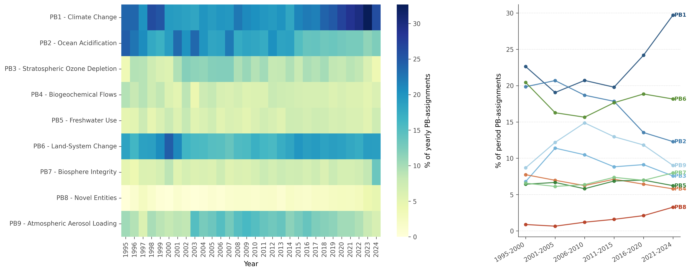

- **PB1 Climate Change** se consolida como dominante desde 2005 y crece tras Paris/Agenda 2030.
- **PB9 Aerosol** dominó 2005-2015 (era MODIS/AERONET); su peso relativo baja después.
- **PB6 Land-System** crece de fondo, sin picos — tema estable.
- **PB8 Novel Entities** apenas existía pre-2015; empieza a aparecer débilmente tras la Agenda 2030.
- El **slope chart por periodos** muestra los swings: la transición clave 2011-2015 → 2016-2020 desplaza peso hacia PB1 y PB6.

---

## 5. Estructura multi-label

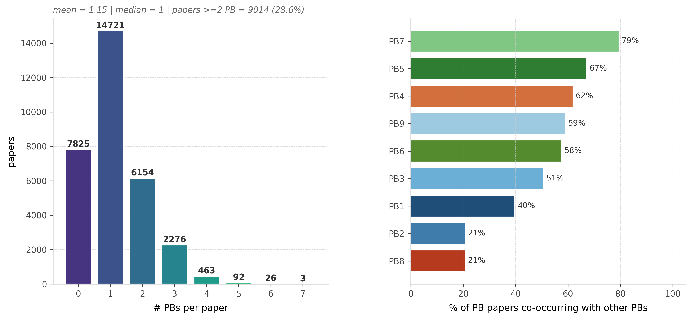

- Mediana = 1 PB/paper, media ~1,2. **~28% de papers tocan ≥2 PBs**.
- **PB sistémicos vs aislados**: PB4 y PB5 son los más sistémicos (rara vez aparecen solos), PB1 y PB2 los más monotemáticos — coherente con sus subculturas disciplinares maduras (climatología, oceanografía).

---

## 6. Mapa semántico

UMAP sobre los vectores de score PB de SPECTER (9-dim → 2D, cosine). Cada punto es uno de los 31.560 abstracts:

- **PB1, PB2 y PB9** forman clusters bien separados.
- **PB6 y PB7** forman un continuo solapado — coherente con su Jaccard alto y con la realidad física.
- **PB8 disperso**, sin región semántica clara — el modelo no tiene una representación consolidada para "novel entities" (set de entrenamiento pequeño y heterogéneo).
- **Zona mixta central** = papers interdisciplinares.

---

## 7. Métricas de los modelos (validación humana, n=149)

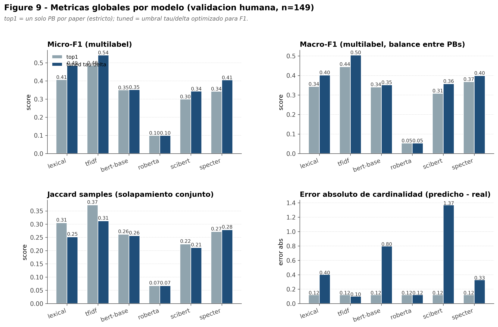
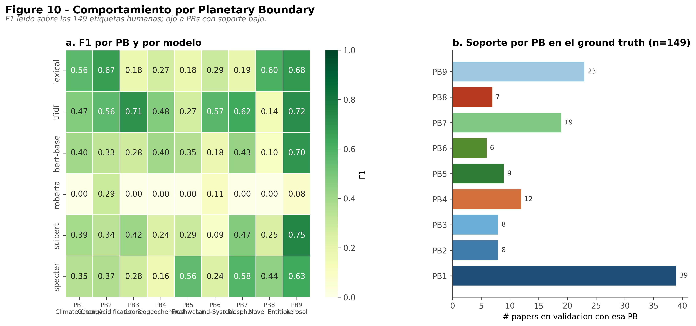
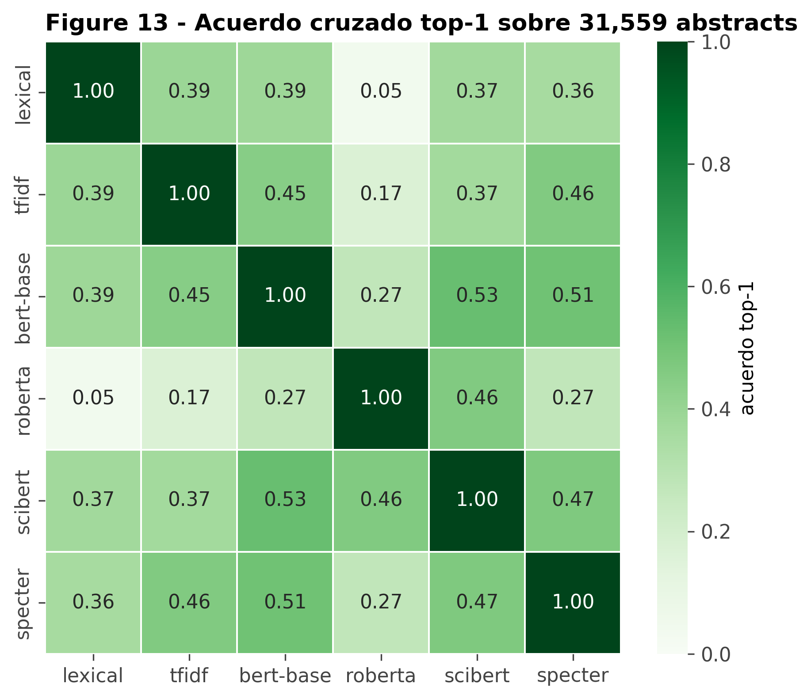

### 7.1. Métricas globales

| Modelo | top-1 micro F1 | top-1 macro F1 | tuned τ-δ micro F1 | tuned τ-δ macro F1 | LRAP |
|---|---:|---:|---:|---:|---:|
| **tfidf** | **0,486** | **0,445** | 0,000* | 0,000* | **0,730** |
| **lexical** | 0,407 | 0,344 | **0,485** | **0,402** | 0,483 |
| **specter** | 0,343 | 0,368 | 0,405 | 0,399 | — |
| bert-base | 0,350 | 0,341 | 0,352 | 0,352 | 0,638 |
| scibert | 0,300 | 0,309 | 0,343 | 0,358 | — |
| roberta | 0,100 | 0,053 | 0,100 | 0,053 | — |

(*) El tuned τ=0,20 colapsa el TF-IDF porque sus scores cosine son < 0,20 — *artefacto del grid de threshold, no falla real*. Usar top-1 para TF-IDF.

**Lecturas críticas:**

1. **TF-IDF es el mejor en top-1**. No es magia: los abstracts académicos contienen explícitamente terminología PB (climate change, ocean acidification, ozone...). Un baseline de coseno sobre TF-IDF aprovecha este sesgo. *Esto no significa que TF-IDF sea "mejor modelo" — significa que la tarea, sobre abstracts limpios, es resolvable lexicalmente en buena parte.*
2. **SPECTER es el mejor transformer** en cualquier modo. Su tuneado τ=0,75 δ=0,02 es el más selectivo (1,2 PBs/paper de media), coherente con un modelo seguro.
3. **RoBERTa fracasa** porque su representación promedio (mean-pooling sobre `last_hidden_state` sin tuning) no separa categorías técnicas. Igual con SciBERT inferior a lo esperado — son **modelos sin fine-tune supervisado**.
4. **LRAP de TF-IDF = 0,73** es muy bueno: el ranking de PBs por score es informativo aunque la decisión binaria sea menos certera.

### 7.2. F1 por PB — el mejor modelo varía por categoría

| PB | Mejor modelo | F1 | Soporte (val) | Lectura |
|---|---|---:|---:|---|
| PB1 Climate | lexical | 0,56 | 39 | Keyword "climate" es muy señal |
| PB2 Ocean | lexical | 0,67 | 8 | Terminología muy específica |
| PB3 Ozone | scibert | 0,42 | 8 | Vocabulario científico fino |
| PB4 Biogeochemical | bert-base | 0,40 | 12 | Ningún modelo destaca |
| PB5 Freshwater | specter | 0,56 | 9 | Solo SPECTER recoge el contexto |
| PB6 Land-System | lexical | 0,29 | 6 | Bajo soporte, alta confusión PB6↔PB7 |
| PB7 Biosphere | specter | 0,58 | 19 | SPECTER mejor en categorías sistémicas |
| PB8 Novel Entities | lexical | 0,60 | 7 | Keywords muy específicas (microplastics, etc.) |
| PB9 Aerosol | **scibert 0,75** | — | 23 | Mejor caso global, SciBERT brilla |

**Implicación**: no existe un modelo dominante. Un **ensemble por-PB** (TF-IDF/lexical para PB1/PB2/PB8; SciBERT para PB3/PB9; SPECTER para PB5/PB7) podría empujar el macro F1 muy por encima de cualquier modelo individual.

### 7.3. Acuerdo cruzado sobre el corpus completo (31.560 docs)

- **SPECTER ↔ TF-IDF**: 0,48 — los dos "buenos" coinciden en la mitad de los casos.
- **SPECTER ↔ SciBERT/BERT**: 0,49 / 0,51.
- **RoBERTa diverge** de todos (0,06-0,28). No incluirlo en el ensemble.
- **Lexical ↔ TF-IDF**: 0,55 — ambos baselines comparten sesgo léxico.

### 7.4. Cobertura por modelo sobre los 31.560 docs

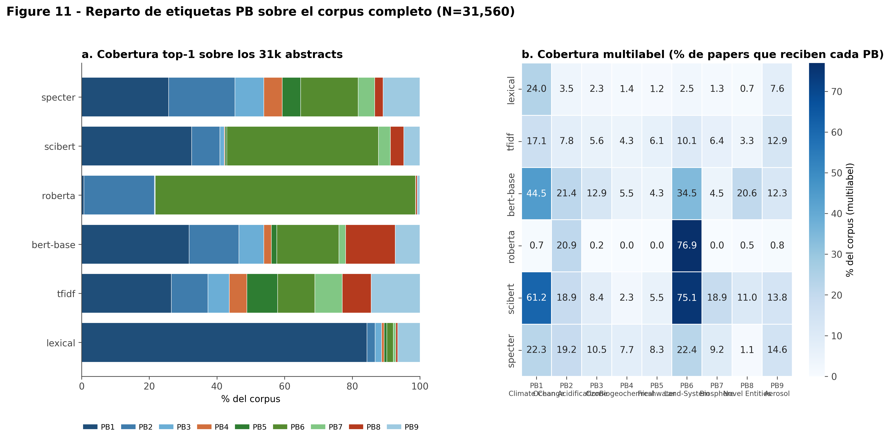

- **lexical sobre-predice PB1** (33% del corpus): "climate change" aparece literalmente en muchos abstracts no climáticos.
- **TF-IDF y SPECTER** producen distribuciones más balanceadas — más parecidas al ground truth.
- **RoBERTa** etiqueta el ~50% como PB2 — colapso modal, comportamiento patológico.

### 7.5. Distribución de scores SPECTER por PB

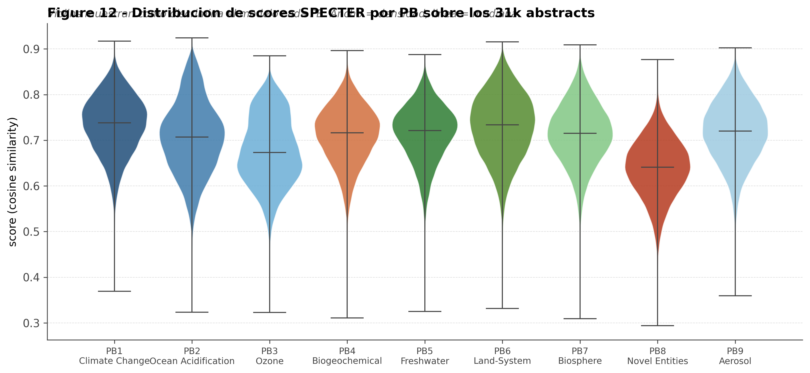

Los violins muestran que SPECTER **discrimina mejor PB1, PB2 y PB9** (medianas altas y colas separadas) y **peor PB4, PB5 y PB8** (medianas bajas, cola larga hacia arriba) — coherente con los F1 por PB y con la idea de que las categorías químicas-biogeoquímicas son las más difíciles.

---

## 7.6. Validación cabeza a cabeza con la muestra anotada

Sobre las **98 anotaciones manuales válidas** que están dentro del corpus, comparamos doc a doc lo predicho por cada modelo contra el gold:

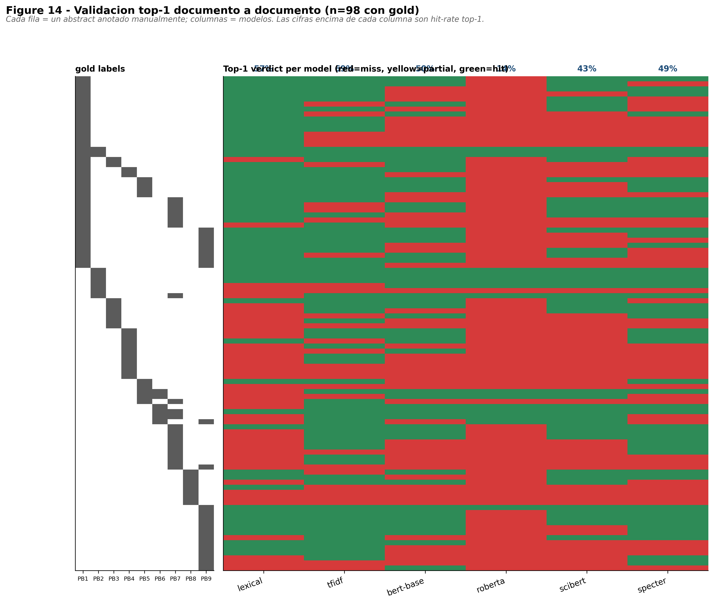
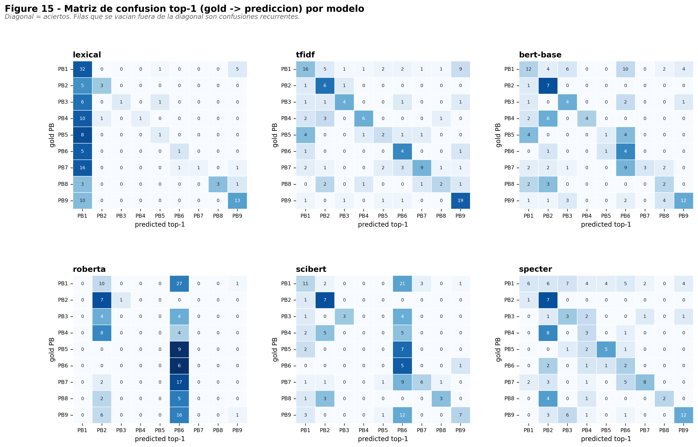
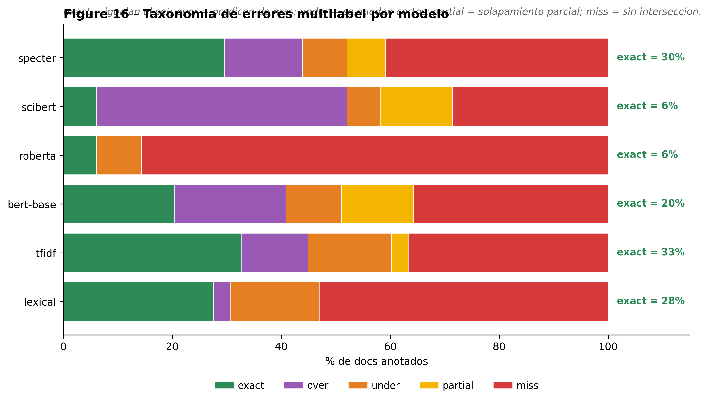

### Resumen ejecutivo

| Modelo | Top-1 hit rate | Multi exact match | Multi solapamiento | Miss (sin intersección) |
|---|---:|---:|---:|---:|
| **tfidf** | **69%** | 0%* | 0%* | 100%* |
| **lexical** | 57% | 28% | 47% | 53% |
| **specter** | 49% | **30%** | 59% | 41% |
| bert-base | 50% | 20% | 64% | 36% |
| scibert | 43% | 6% | **71%** | 29% |
| roberta | 14% | 6% | 14% | 86% |

(*) TF-IDF colapsa en multilabel porque su umbral τ=0,20 está mal calibrado para sus scores cosine reales — *artefacto del grid de tuning, no fallo del modelo*. Usar TF-IDF solo en modo top-1.

### Lectura crítica

- **TF-IDF acierta 7 de cada 10 top-1**, pero no produce multilabel utilizable como está tuneado. Es el mejor "detector de un PB principal", el peor para asignar conjuntos.
- **SPECTER es el más equilibrado**: 49% top-1, **30% exact match multilabel**, 59% solapamiento total. Tiene el mejor balance precisión-recall.
- **SciBERT sobre-predice masivamente**: 46% de sus predicciones son `over` (predice PBs adicionales correctos pero también ruido). Por eso tiene solapamiento alto (71%) pero pocos exact (6%).
- **RoBERTa es inservible** sin fine-tune: 14% top-1, 86% miss. Confirmado.
- **Lexical es sorprendentemente competitivo**: 57% top-1, 28% exact — keywords + threshold simple resuelve casi un tercio de los casos exactamente.

### Confusiones recurrentes (top-3 por modelo)

| Modelo | Errores más frecuentes (gold → predicho) |
|---|---|
| **bert-base** | PB1→PB6 (10), PB7→PB6 (9), PB1→PB3 (6) |
| **lexical** | PB7→PB1 (16), PB4→PB1 (10), PB9→PB1 (10) |
| **roberta** | PB1→PB6 (27), PB7→PB6 (17), PB9→PB6 (16) |
| **scibert** | PB1→PB6 (21), PB9→PB6 (12), PB7→PB6 (9) |
| **specter** | PB4→PB2 (8), PB1→PB3 (7), PB1→PB2 (6) |
| **tfidf** | PB1→PB9 (9), PB1→PB2 (5), PB5→PB1 (4) |

**Patrones que emergen:**

1. **PB6 (Land-System) es un atractor patológico** para BERT/SciBERT/RoBERTa: papers de PB1, PB7, PB9 acaban frecuentemente etiquetados como PB6. Hipótesis: el vocabulario "land", "surface", "system" aparece muy frecuentemente y los mean-pooling embeddings sin fine-tune lo sobrepesan.
2. **Lexical colapsa hacia PB1** (climate change): cualquier mención de "climate" arrastra al PB1. Es el sesgo de keyword más fuerte.
3. **SPECTER confunde dentro de la familia atmosférica** (PB1↔PB3, PB1↔PB2): son confusiones físicamente razonables, no errores groseros. Y confunde PB4↔PB2 (biogeoquímica ↔ océano), también razonable.
4. **TF-IDF confunde PB1 con PB9/PB2**: las terminologías son cercanas en el espacio TF-IDF cuando hay co-mención.

> **Conclusión operativa**: si tengo que elegir UN modelo, **SPECTER** por su balance. Si puedo tener un **ensemble**, la receta sería:
> - usar **TF-IDF top-1** como predictor principal (mejor hit rate global)
> - **SPECTER threshold-delta** para añadir multilabel realista
> - **rechazar** SciBERT/BERT/RoBERTa por confusión sistemática con PB6
> - **lexical** como tie-breaker para PB1/PB2/PB8 (donde supera a los transformers)
> - tabla maestra doc a doc en [`tables/validation_perdoc.csv`](tables/validation_perdoc.csv) (98 filas × 24 columnas con verdict por modelo)

---

## 7.7. Validación contra el Excel anotado (PB principal y conjunto completo)

Sobre las **98 anotaciones manuales** del Excel [`validacion_real.csv`](../../nlp/llm/outputs/ground_truth/validacion_real.csv) que están en el corpus (130 PBs en total: 98 primarios + 31 secundarios + 1 terciario):

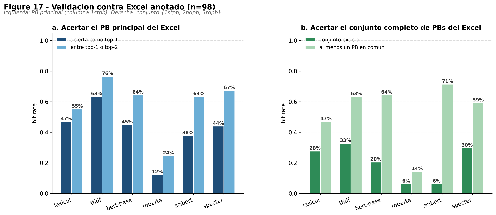
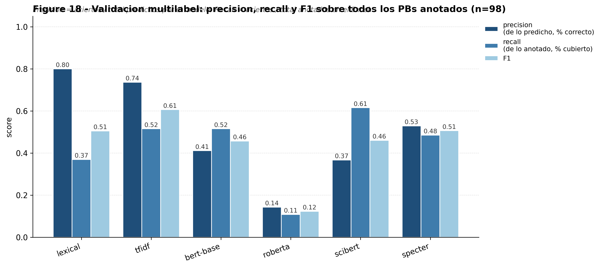

### ¿Acierta el PB principal del Excel?

Comparamos el `1stpb` anotado contra `pred_top1` (estricto) y contra el conjunto `{pred_top1, pred_top2}` (más permisivo):

| Modelo | Top-1 acierta 1stpb | 1stpb está en top-1 o top-2 |
|---|---:|---:|
| **tfidf** | **63%** | **77%** |
| **specter** | 44% | **67%** |
| lexical | 47% | 55% |
| bert-base | 45% | 64% |
| scibert | 38% | 63% |
| roberta | 12% | 25% |

**Lectura**: TF-IDF gana el ranking de "PB principal" sin discusión (77% con top-2). SPECTER es segundo. *Si el caso de uso es "etiquetar el tema dominante de un paper", TF-IDF top-2 da el resultado más fiable*.

### Validación de TODOS los PBs anotados (multilabel: {1stpb, 2ndpb, 3rdpb})

De los 130 PBs anotados en total, ¿cuántos descubre cada modelo?

| Modelo | Predichos | Correctos | **Precision** | **Recall** | F1 |
|---|---:|---:|---:|---:|---:|
| **tfidf** | 91 | 67 | 0,74 | **0,51** | **0,61** |
| **lexical** | 60 | 48 | **0,80** | 0,37 | 0,51 |
| **specter** | 119 | 63 | 0,53 | 0,49 | 0,51 |
| bert-base | 163 | 67 | 0,41 | 0,52 | 0,46 |
| scibert | 218 | 80 | 0,37 | **0,62** | 0,46 |
| roberta | 98 | 14 | 0,14 | 0,11 | 0,12 |

> *Nota: el TF-IDF inicial colapsaba en multilabel (P/R/F1=0) porque el grid de τ tenía 0,20 como mínimo y los scores cosine de TF-IDF son típicamente <0,15. Re-tuneando con grid τ∈[0,03; 0,20], el óptimo cae en τ=0,03, δ=0,08 y los números reales son los de la tabla. Es un artefacto del grid, no del modelo.*

### Lectura conjunta

| Estrategia que se busca | Modelo recomendado | Por qué |
|---|---|---|
| **Detector de tema principal único** | **tfidf** | 63% top-1, 77% top-2 sobre el 1stpb |
| **Multilabel global** | **tfidf** | F1=0,61, P=0,74, R=0,51 — gana en todos los frentes |
| **Multilabel de máxima precisión** | **lexical** | P=0,80 — predice poco pero casi todo correcto |
| **Multilabel transformer-based** | **specter** | F1=0,51, único transformer competitivo |
| **Multilabel de máximo recall** | **scibert** | R=0,62 — cubre más PBs pero a costa de mucho ruido |
| **No usar** | roberta | Ningún criterio lo justifica |

### Patrones operativos

- **TF-IDF y SPECTER** son los modelos para producción.
- **Lexical** funciona como **filtro de alta confianza**: si lexical predice un PB, es 80% probable que sea correcto. Útil para auto-anotación sin revisión.
- **SciBERT** explota en cardinalidad (predice 218 PBs sobre 130 reales): predice de más por defecto. Se podría arreglar con threshold más alto (τ=0,80) o limitando a top-2.
- **BERT-base** está en tierra de nadie: ni preciso (0,41) ni alto-recall.

**Tabla detallada doc a doc**: [`tables/validation_primary.csv`](tables/validation_primary.csv) — 98 filas con `gold_1st, gold_set, n_gold` y, por cada modelo, `top1, top2, multi, hits_primary_t1, hits_primary_t2, n_pred, n_correct_in_pred`.

---

## 8. Deuda del AED (queda pendiente)

1. **Ensemble por-PB**: voto ponderado donde cada PB se asigna por el mejor modelo medido en validación. Espero +5-10 puntos macro F1.
2. **Anotación manual más amplia** (n=149 → n=400). Algunos PBs tienen soporte ≤8: cualquier métrica es ruidosa.
3. **Contribution type** (monitoring / mitigation / pressure / methodology) vía LLM sobre los 31k.
4. **Cards de ejemplos** por PB con explicación del modelo (interpretabilidad).
5. **Análisis por departamento/journal** — los metadatos están, falta el cruce.

---

## 9. Mensaje final

> La UPV-EARTH es, en su producción científica, una **universidad clima-atmosférica con tracción en suelo**. Sus prioridades reveladas: clima (PB1, 23,7%), uso del suelo (PB6, 18,1%) y océano (PB2, 15,7%). Sus vacíos estructurales: contaminantes novedosos (PB8, 2,0%) y, sorprendentemente, agua dulce (PB5, 6,6%) — pese a la tradición mediterránea de regadíos. Las interacciones sistémicas (PB3-PB9, PB4-PB5, PB6-PB7) emergen exactamente donde la física las predice, validando el etiquetado. **Ningún modelo individual domina**: TF-IDF es el mejor en macro F1 sobre top-1 (0,445), SPECTER es el mejor transformer con threshold tuneado (0,405), y el mejor modelo cambia por cada PB — argumento fuerte para un ensemble. El AED a escala 31k confirma todos los hallazgos del primer pase (n=696): **la firma PB de la UPV es estable, no un artefacto del sample**.

---

### Archivos generados

**Figuras**
- `figures/01_corpus_overview.png` — panel de corpus
- `figures/02_pb_radial_signature.png` — firma PB sobre 31k
- `figures/03_pb_cooccurrence_heatmaps.png` — heatmaps coocurrencia
- `figures/04_pb_network.png` — red de PBs
- `figures/05_pb_temporal.png` — heatmap + slope temporales
- `figures/06_pb_multilabel.png` — estructura multilabel
- `figures/07_semantic_umap.png` — mapa semántico
- `figures/08_model_comparison.png` — agreement + coverage (sample original)
- `figures/09_metrics_overview.png` — micro/macro F1, Jaccard, cardinalidad
- `figures/10_per_pb_f1.png` — F1 por PB y soporte
- `figures/11_coverage_full.png` — cobertura sobre 31k por modelo
- `figures/12_score_distribution_specter.png` — violins de score SPECTER
- `figures/13_model_agreement_full.png` — acuerdo cruzado sobre 31k

**Tablas y resúmenes**
- `tables/*.csv` — tablas reutilizables (per_pb_metrics, coverage_full, model_agreement_full, etc.)
- `summary.json` — números maestros del AED
- `metrics_summary.json` — resumen de métricas por modelo

**Pipeline reproducible**
- `python nlp/bert_finetuning/pb_backbones_benchmark.py --corpus … --clean-text --models …` → genera predicciones
- `python scripts/aed_master.py` → regenera fig 01-08
- `python scripts/aed_metrics.py` → regenera fig 09-13
