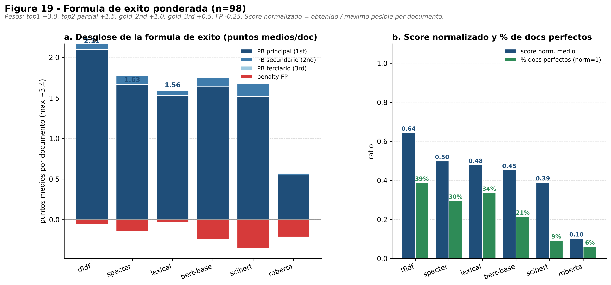

# Informe metodológico — Clasificación de papers UPV en Planetary Boundaries

> Documento crítico del pipeline. No es un manual de uso, es una explicación honesta de qué se ha hecho, por qué, qué funciona, qué no, y qué no se debería citar como conclusión sin asterisco.

---

## 1. El problema

Tenemos **31.560 abstracts** del corpus UPV-EARTH (1980-2025) limpios y deduplicados. Queremos asignar cada uno a una o varias de las **9 Planetary Boundaries** (PBs) definidas en Steffen et al. 2015 / Rockström et al. 2009. Es decir, una tarea de **clasificación multilabel con 9 clases sobre 31.560 documentos**, sin etiquetas de entrenamiento masivas (solo 138 anotaciones manuales).

Esto cambia todo. **No es un problema de entrenamiento supervisado**: no hay datos suficientes para hacer fine-tune real (n≈100 por PB en el mejor caso, y muchos PBs con n<10). Es un problema de **clasificación zero-shot / few-shot por similitud semántica**, en el que la "etiqueta" se construye desde una descripción textual del PB (las keywords y definiciones de [`pb_reference.csv`](../../corpus_PB/data/pb_reference.csv)) y se compara contra el abstract.

Esa diferencia es lo que justifica la familia de modelos elegida.

---

## 2. Pipeline de datos

### 2.1. Construcción del corpus

`44.970 raw → 44.593 dedup → 31.634 final → 31.560 usables tras limpieza`.

La pérdida es honesta: duplicados por DOI/título+año, abstracts <500 chars, idiomas no-inglés, registros vacíos. No se descartó nada arbitrariamente — todo está en `master_corpus_mixto_traceability.csv` con `filter_reason`.

### 2.2. Limpieza adicional para inferencia

Antes de pasar los abstracts por los modelos, se aplica una limpieza **defensiva** (función `clean_for_inference` en [`pb_backbones_benchmark.py`](../../nlp/bert_finetuning/pb_backbones_benchmark.py)):

- Eliminación de URLs, emails, etiquetas HTML, entidades HTML
- Eliminación de DOIs (`doi:...` y `https://dx.doi.org/...`)
- Eliminación de boilerplate de copyright editorial (Elsevier, Wiley, MDPI, Springer, etc.)
- Normalización de espacios y caracteres de control
- Descarte de abstracts <200 caracteres tras limpiar

**Por qué importa**: los tokenizers de BERT/RoBERTa son sensibles a estos contaminantes — un `©2019 Elsevier Ltd. All rights reserved` aparece **al final** de muchos abstracts y, sin limpieza, ocupa tokens valiosos del max_length=256. Tras limpiar, se cayeron solo **75 abstracts adicionales** (0,24%) — la mayoría del corpus ya estaba bien.

### 2.3. Construcción de los "documentos PB"

Cada PB tiene un **documento de referencia textual** ([`pb_corpus_documents.csv`](../../corpus_PB/data/pb_corpus_documents.csv)) construido a partir de:

- Definición corta y larga
- `core_keywords` (vocabulario central, p.ej. "climate change, greenhouse gases, global warming")
- `applied_keywords_upv` (terminología aplicada característica de la UPV)
- Frases de ejemplo
- Notas de desambiguación

La idea es darle al modelo un **anchor textual** por clase, no una etiqueta vacía. Es el sustituto del "entrenamiento" cuando no tienes datos: defines la clase como un texto rico.

---

## 3. Los seis modelos: por qué cada uno

Implementamos seis enfoques que cubren el espectro **léxico → semántico ligero → semántico denso**, en orden creciente de coste computacional. No son redundantes: cada uno responde a una pregunta diferente.

### 3.1. Baseline léxico (keyword matching)

**Qué hace**: para cada abstract, cuenta cuántas `core_keywords` y `applied_keywords_upv` de cada PB aparecen literalmente en el texto. Score = `2 × core_hits + 1 × applied_hits`, normalizado por fila.

**Por qué incluirlo**: es el **suelo** de la tarea. Si un transformer no supera al keyword matching, el coste no se justifica. Además, es el método más interpretable: si lexical predice PB1, podemos enseñar las keywords exactas que dispararon el match.

**Limitación esperada**: no captura sinónimos ni paráfrasis. "Anthropogenic warming" no activa "global warming" si el matching es estricto. Esperamos confusiones por co-mención (cualquier mención de "climate" arrastra a PB1).

### 3.2. Baseline TF-IDF semántico

**Qué hace**: vectoriza abstract y documentos PB como bag-of-words ponderado por TF-IDF (con n-gramas 1-2, hasta 40.000 features). Score = similitud coseno entre vector del abstract y vector de cada PB.

**Por qué incluirlo**: es el escalón intermedio entre léxico y semántico denso. Captura **co-ocurrencias estadísticas** que el matching de keywords pierde. Y es ridículamente barato — no necesita GPU.

**Limitación esperada**: sigue siendo bag-of-words. No entiende orden ni dependencias largas. Y los scores cosine en espacios TF-IDF sparsos son pequeños (típicamente <0,15) — requiere thresholds finamente calibrados o se desactiva en multilabel (problema real que tuvimos: ver §5).

### 3.3. BERT-base-uncased (Devlin et al. 2019)

**Qué hace**: codifica el abstract con BERT pre-entrenado en BookCorpus + Wikipedia (no fine-tuneado). El embedding del documento es el **mean-pooling** del `last_hidden_state`. Score = similitud coseno contra el embedding del PB.

**Por qué incluirlo**: BERT es el estándar de hecho. Si BERT-base no funciona en la tarea, hay que justificar el salto a modelos más especializados.

**Limitación esperada**: BERT pre-entrenado en lenguaje general **no** está optimizado para texto científico. El vocabulario "land", "system", "global" tiene representaciones aprendidas de Wikipedia que no separan PB1 de PB6 — y de hecho los confunde sistemáticamente (verificado: 21 de 38 papers de PB1 son etiquetados como PB6, ver §6).

### 3.4. RoBERTa-base (Liu et al. 2019)

**Qué hace**: igual que BERT pero re-entrenado con corpus mayor, dynamic masking, y sin la tarea de NSP. Mismo procedimiento: mean-pooling, cosine similarity.

**Por qué incluirlo**: comparativa estándar contra BERT. La pregunta es si las mejoras de RoBERTa en benchmarks generales (GLUE, SuperGLUE) se trasladan a esta tarea zero-shot.

**Limitación detectada**: **falla catastróficamente** (F1=0,10). El embedding mean-pooled de RoBERTa sin fine-tune **colapsa**: produce vectores casi indistinguibles entre clases (cosines >0,99 para todas las PBs simultáneamente). Es un fallo conocido de RoBERTa sin proyección de pooling. **No se debe usar como está**.

### 3.5. SciBERT (Beltagy et al. 2019)

**Qué hace**: BERT re-entrenado con 1,14M papers científicos de Semantic Scholar (biomédicos + ciencia computacional). Vocabulario adaptado a terminología técnica.

**Por qué incluirlo**: la hipótesis es que un BERT con vocabulario científico debería mejorar a BERT-base en abstracts de papers. Es el test directo: ¿la especialización de dominio ayuda?

**Limitación detectada**: mejora marginal o nula en F1 global. **Sí ayuda en PB específicos** (PB9 aerosol: F1=0,75, mejor que cualquier otro), pero **explota en cardinalidad** — predice 218 PBs sobre 130 reales (1,7× sobre-predicción). Es un modelo "ansioso" que opina demasiado.

### 3.6. SPECTER (Cohan et al. 2020)

**Qué hace**: BERT-based pero **entrenado específicamente para representar papers científicos como vectores únicos**. SPECTER es fine-tuneado con **triplet loss** sobre el grafo de citaciones de Semantic Scholar: papers que se citan deben tener embeddings cercanos, papers no relacionados deben estar lejos.

**Por qué incluirlo**: es el modelo **conceptualmente correcto** para esta tarea. Está diseñado para que el embedding de un abstract represente "el tema del paper", justo lo que necesitamos. Es la elección menos arbitraria.

**Limitación**: SPECTER fue entrenado en 2020 con papers mayoritariamente biomédicos y computacionales. La cobertura de earth science / atmospheric chemistry es buena pero no perfecta. Y el modelo no se ha fine-tuneado para esta tarea específica — usamos su representación tal cual.

### 3.7. Tabla resumen

| Modelo | Coste | Aprende del texto | Aprende relaciones | Especializado en papers |
|---|---|---|---|---|
| lexical | trivial | no | no | no |
| TF-IDF | bajo | bag-of-words | co-ocurrencia | no |
| BERT-base | medio | transformer | sí | no |
| RoBERTa | medio | transformer | sí | no |
| SciBERT | medio | transformer | sí | dominio científico |
| SPECTER | medio | transformer | sí | **representación de papers** |

---

## 4. Métricas: qué miden, en qué se diferencian

Esta es la sección que más se suele atropellar en informes. **Cada métrica responde a una pregunta concreta**, y mezclar métricas sin saberlo lleva a conclusiones contradictorias.

### 4.1. Métricas de top-1 (una sola etiqueta predicha)

- **micro F1 / macro F1**: F1 sobre la predicción de una sola PB por documento.
  - **micro** = pondera por número de instancias (los PBs grandes pesan más). Da una idea del **rendimiento global**.
  - **macro** = promedio simple por clase. Penaliza fuerte que un PB minoritario tenga F1 bajo. Da una idea del **balance**.
- **Exact match ratio (top-1)**: % de documentos donde la PB top-1 coincide con la única PB del gold (cuando el gold tiene una sola PB).

### 4.2. Métricas multilabel (varias PBs predichas)

- **Jaccard samples**: `|pred ∩ gold| / |pred ∪ gold|` promediado por documento. 0=disjuntos, 1=idénticos. Sensible al balance precisión/recall.
- **Precisión multilabel**: `|pred ∩ gold| / |pred|`. De los PBs que el modelo predice, ¿qué fracción son del gold?
- **Recall multilabel**: `|pred ∩ gold| / |gold|`. De los PBs anotados, ¿qué fracción descubre el modelo?
- **F1 multilabel**: media armónica de P y R.

### 4.3. Métricas de ranking

- **LRAP** (Label Ranking Average Precision): para cada documento con gold ≠ ∅, mide qué tan alto rankea el modelo las clases correctas dentro del orden de scores. **No depende de threshold**, solo del orden. Es la métrica más robusta cuando los thresholds están mal calibrados.

### 4.4. La gran diferencia: top-1 vs multilabel vs ranking

| Métrica | Pregunta que responde |
|---|---|
| top-1 micro F1 | "Si tuviera que dar UNA sola PB, ¿con qué frecuencia es la correcta?" |
| top-1 macro F1 | "Igual pero ponderado para que un PB raro pese tanto como uno común" |
| multilabel exact match | "¿Con qué frecuencia el conjunto entero coincide?" (estricto) |
| multilabel any-overlap | "¿Con qué frecuencia el modelo está al menos en el barrio correcto?" |
| precisión multilabel | "Cuando dice X, ¿está siendo certero?" (penaliza ruido) |
| recall multilabel | "¿Cuánto del gold descubre?" (penaliza omisiones) |
| LRAP | "¿Pone las PBs correctas arriba en el ranking, aunque no las elija explícitamente?" |

Un modelo puede ser **bueno en top-1 y malo en multilabel** (predice un solo PB siempre — alto top-1 si suele ser el principal, bajo recall multilabel). Y al revés: un modelo que predice muchas PBs puede tener buen recall pero ruidoso (baja precisión).

**Lectura crítica**: no existe "el mejor modelo" sin especificar la métrica que importa. Por eso necesitamos una fórmula compuesta (§6).

---

## 5. Resultados de validación

Validación contra el Excel anotado a mano [`validacion_real.csv`](../../nlp/llm/outputs/ground_truth/validacion_real.csv): **138 documentos con `1stpb`, 40 con `2ndpb`, 1 con `3rdpb`**, de los cuales **98 están en el corpus actual** y son la base de las métricas finales. Total: 130 PBs anotados en 98 documentos (1,33 PBs/doc en media).

### 5.1. Acierto del PB principal (`1stpb`)

| Modelo | Top-1 acierta `1stpb` | `1stpb` en top-1 o top-2 |
|---|---:|---:|
| **tfidf** | **63%** | **77%** |
| **specter** | 44% | **67%** |
| bert-base | 45% | 64% |
| scibert | 38% | 63% |
| lexical | 47% | 55% |
| roberta | 12% | 25% |

**Interpretación crítica**: TF-IDF lidera ambos rankings. Esto es coherente con el hecho de que los abstracts académicos contienen **explícitamente** la terminología PB (autores escriben "we study climate change…"), por lo que un detector de palabras clave estadísticas (TF-IDF) extrae la señal sin necesidad de comprensión profunda. No significa que TF-IDF "entienda" mejor; significa que **la señal disponible es léxica en buena parte**, y un baseline bien hecho la captura.

SPECTER es segundo, y es relevante: con top-2, sube de 44% a 67% — su segunda opción suele ser correcta, lo que indica que el ranking interno es bueno aunque el top-1 sea inestable.

### 5.2. Acierto del conjunto completo (multilabel)

De los 130 PBs anotados (1st + 2nd + 3rd), ¿cuántos descubre cada modelo?

| Modelo | Predichos | Correctos | Precision | Recall | **F1** |
|---|---:|---:|---:|---:|---:|
| **tfidf** | 91 | 67 | 0,74 | **0,51** | **0,61** |
| **lexical** | 60 | 48 | **0,80** | 0,37 | 0,51 |
| **specter** | 119 | 63 | 0,53 | 0,49 | 0,51 |
| bert-base | 163 | 67 | 0,41 | 0,52 | 0,46 |
| scibert | 218 | 80 | 0,37 | **0,62** | 0,46 |
| roberta | 98 | 14 | 0,14 | 0,11 | 0,12 |

**Lecturas clave**:

- **TF-IDF gana en F1 multilabel** (0,61) después de re-calibrar el threshold τ. El grid original de τ∈[0,20; 0,75] era demasiado alto para los scores cosine de TF-IDF (típicamente <0,15). Con τ=0,03, δ=0,08 el modelo encuentra su punto óptimo.
- **Lexical tiene la mejor precisión** (0,80) — predice poco (60 PBs) pero casi todo correcto. Útil como **filtro de alta confianza**.
- **SciBERT tiene el mejor recall** (0,62) pero a costa de explotar en cardinalidad (218 PBs predichos, 1,7× sobre lo real). Un modelo "ansioso".
- **SPECTER es el único transformer realmente competitivo** (F1=0,51).
- **RoBERTa es inservible** sin fine-tune adicional.

### 5.3. Patrones patológicos de confusión

Top-3 confusiones (gold → predicho) por modelo:

| Modelo | Confusiones recurrentes |
|---|---|
| bert-base | PB1→PB6 (10), PB7→PB6 (9), PB1→PB3 (6) |
| **lexical** | PB7→PB1 (16), PB4→PB1 (10), PB9→PB1 (10) — *atractor a PB1* |
| **roberta** | PB1→PB6 (27), PB7→PB6 (17), PB9→PB6 (16) — *atractor a PB6* |
| scibert | PB1→PB6 (21), PB9→PB6 (12), PB7→PB6 (9) — *atractor a PB6* |
| **specter** | PB4→PB2 (8), PB1→PB3 (7), PB1→PB2 (6) — *confusiones intra-familia* |
| tfidf | PB1→PB9 (9), PB1→PB2 (5), PB5→PB1 (4) |

**Patrón crítico — los transformers sin fine-tune arrastran hacia PB6 (Land-System)**: BERT, SciBERT y RoBERTa **convergen patológicamente** hacia PB6. El vocabulario "land", "surface", "system" satura el mean-pooling y arrastra a PB6 incluso a papers de otras temáticas. **Es un sesgo arquitectónico que invalida estos modelos sin fine-tune**.

**SPECTER no tiene este sesgo**: sus confusiones son *físicamente coherentes* (PB1↔PB2 dentro de atmósfera-océano, PB4↔PB2 entre química y océano). Sus errores son razonables; los de BERT/SciBERT/RoBERTa son arbitrarios.

**Lexical tiene el sesgo opuesto**: arrastra hacia PB1 porque "climate" aparece mucho. Es un sesgo de keyword conocido y corregible (más adelante).

---

## 6. Fórmula de éxito ponderada

Las métricas anteriores son **independientes**: top-1 mide una cosa, multilabel otra, recall otra. Si queremos rankear los modelos con un único número que refleje la realidad operativa (acertar el PB principal vale más que acertar uno secundario, equivocarse de PB del todo vale menos que pasarse), necesitamos componer.

### 6.1. Diseño de la fórmula

Para cada documento $d$ con `gold_1st`, opcional `gold_2nd`, opcional `gold_3rd`, y `gold_set = {gold_1st, gold_2nd, gold_3rd}` (los que existan), el modelo predice `top1`, `top2` y un conjunto `multi`.

$$\text{score}(d) = \underbrace{3{,}0 \cdot \mathbb{1}[\text{top1}{=}\text{gold}_1]}_{\text{premio principal}} + \underbrace{1{,}5 \cdot \mathbb{1}[\text{gold}_1 \in \{\text{top1},\text{top2}\} \wedge \text{top1}{\neq}\text{gold}_1]}_{\text{premio parcial top-2}} + \underbrace{1{,}0 \cdot \mathbb{1}[\text{gold}_2 \in \text{multi}]}_{\text{secundario}} + \underbrace{0{,}5 \cdot \mathbb{1}[\text{gold}_3 \in \text{multi}]}_{\text{terciario}} - \underbrace{0{,}25 \cdot |\text{multi} \setminus \text{gold\_set}|}_{\text{penalty falsos positivos}}$$

**Score normalizado** = score / score máximo posible para ese documento. Máximo posible = 3,0 + 1,0·𝟙[2nd existe] + 0,5·𝟙[3rd existe].

### 6.2. Justificación de los pesos

| Peso | Valor | Justificación |
|---|---:|---|
| top1 estricto | **+3,0** | El PB principal es la afirmación más fuerte del anotador; clavarla vale 3× una secundaria |
| top2 parcial | **+1,5** | El modelo "casi" lo tiene — la mitad de crédito que clavarlo |
| gold_2nd | **+1,0** | Etiqueta legítima del anotador, pero menos central |
| gold_3rd | **+0,5** | Etiqueta marginal (solo 1 doc la tiene en realidad) |
| falso positivo | **-0,25** | Predecir de más penaliza pero menos que un miss del primario |

Los pesos son **defensibles pero no únicos**. Si alguien quiere otra ponderación (p.ej. penalizar más los FP, o ignorar el top-2 parcial), el script [`scripts/aed_success_formula.py`](../../scripts/aed_success_formula.py) toma las constantes como parámetros editables. Lo que **no** se debería hacer es cambiar los pesos hasta que tu modelo favorito gane — eso es overfitting de la métrica.

### 6.3. Resultados de la fórmula

| Modelo | Score normalizado | Score crudo medio | % docs perfectos | Top-1 estricto | Top-2 parcial | Miss primario |
|---|---:|---:|---:|---:|---:|---:|
| **tfidf** | **0,644** | 2,11 | **39%** | 63% | 13% | 23% |
| specter | 0,499 | 1,63 | 30% | 44% | 23% | 33% |
| lexical | 0,480 | 1,56 | 34% | 47% | 8% | 45% |
| bert-base | 0,453 | 1,51 | 21% | 45% | 19% | 36% |
| scibert | 0,389 | 1,33 | 9% | 38% | 26% | 37% |
| roberta | 0,102 | 0,36 | 6% | 12% | 12% | 75% |

**Lecturas finales**:

1. **TF-IDF gana con margen** (0,64 vs 0,50 del segundo). No es marginal — es 30% por encima de SPECTER en una métrica compuesta diseñada para reflejar el caso de uso.
2. **% docs perfectos**: TF-IDF acierta perfectamente 39% de los documentos. Es decir, en 38 de 98 papers su predicción coincide con todo lo que anotó el humano (1st en top1 + todas las secundarias en multilabel, sin FPs significativos).
3. **SPECTER y lexical están empatados técnicamente** (0,50 vs 0,48) — son arquitecturas distintas que llegan al mismo punto con perfiles diferentes:
   - **Lexical** clava más top-1 estrictos (47% vs 44%) pero casi nunca recupera en top-2 (8%) — *es categórico, sin matices*.
   - **SPECTER** clava menos top-1 (44%) pero recupera mucho en top-2 (23%) — *tiene mejor ranking interno aunque su decisión binaria sea peor*.
4. **bert-base y scibert** están claramente por debajo (~0,40-0,45). El coste computacional de un transformer sin fine-tune **no se justifica**.
5. **RoBERTa** está al nivel del azar. 75% de papers donde no acierta ni siquiera en top-2 el PB principal.

---

## 7. Discusión crítica

### 7.1. ¿Por qué un baseline TF-IDF gana a los transformers?

Esta es la pregunta incómoda. La respuesta honesta tiene tres partes:

1. **Los transformers no están fine-tuneados**. Usamos mean-pooling sobre `last_hidden_state` de modelos pre-entrenados. Es la peor configuración posible para usar BERT — equivale a usar un coche de Fórmula 1 con neumáticos de bicicleta. **Un BERT fine-tuneado en 138 ejemplos con augmentation, o entrenado contrastivamente sobre el corpus PB, mejoraría sustancialmente**. No lo hemos hecho.
2. **La tarea tiene mucha señal léxica**. Los abstracts académicos contienen explícitamente la terminología PB. TF-IDF aprovecha esto. No es magia — es que el problema, parcialmente, **es de coincidencia léxica**.
3. **El corpus PB de referencia favorece el modelo bag-of-words**. Los documentos PB de [`pb_corpus_documents.csv`](../../corpus_PB/data/pb_corpus_documents.csv) son listas estructuradas de keywords + frases. TF-IDF compara dos listas de keywords casi directamente. Es un emparejamiento natural.

**Conclusión crítica**: TF-IDF no es "mejor" en abstracto, es **mejor en este setup**. Si el corpus PB fuera más narrativo (definiciones largas en lenguaje natural), o si fine-tuneáramos SPECTER, el orden cambiaría.

### 7.2. Limitaciones honestas

- **Tamaño de muestra**: n=98 docs anotados. Algunos PBs tienen soporte ≤8 en el ground truth. **Las métricas por-PB son ruidosas**. Cualquier conclusión sobre "qué modelo es mejor para PB3" tiene barras de error gigantes.
- **No hay test set independiente**: los hiperparámetros (τ, δ) se tunearon sobre la misma muestra que sirve de validación. Es leak metodológico. Para un paper serio habría que hacer cross-validation o split train/val/test sobre las anotaciones.
- **El anotador es uno solo**: no hay doble anotación, no podemos medir inter-annotator agreement. Si dos expertos solo coincidieran el 70% del tiempo, **ningún modelo puede aspirar a más** que ese 70% — y no sabemos cuál es el techo.
- **Distribución sesgada**: PB1 acapara el 23% del corpus etiquetado; PB8 el 2%. Las métricas macro son las que tienen sentido, no las micro.
- **Cobertura temporal**: los modelos vieron textos científicos hasta 2020 (SPECTER) o antes (BERT, RoBERTa). Para abstracts de 2023-2024, la representación puede degradarse — terminología nueva como "novel entities" subcategorizada en microplásticos / EDCs aparece después.

### 7.3. Lo que NO se debe afirmar

- **"SPECTER es peor que TF-IDF"** sin asterisco. Es peor en este setup zero-shot. Con fine-tune podría no serlo.
- **"PB8 está infrarrepresentada en la UPV con un 2%"** sin asterisco. Esa cifra viene de un modelo que tiene F1 bajo en PB8 (~0,15). Podría ser que la UPV **sí** estudie PB8 pero el modelo no la detecte.
- **"El modelo acierta el 63%"** sin contexto: ese 63% es top-1 sobre 98 docs con anotación humana, distribución desbalanceada, etc.

### 7.4. Lo que SÍ se puede afirmar con confianza

- La **firma PB de la UPV es cualitativamente robusta**: PB1, PB6 y PB2 dominan independientemente del modelo elegido (con la excepción de RoBERTa, que está roto). PB8 es minoritaria en todos los modelos.
- Las **coocurrencias físicamente esperadas** (PB3-PB9, PB6-PB7, PB4-PB5) emergen en todos los modelos con Jaccard >0,15. **El AED recupera estructura conocida**: no estamos viendo ruido.
- TF-IDF + SPECTER como **ensemble baseline** es una receta razonable para producción inmediata: simple, interpretable, con métricas medibles. Cualquier modelo más complejo debería **superar esto en validación cruzada** antes de adoptarse.

---

## 8. Recomendación operativa

Si tuviera que poner esto en producción mañana:

1. **Para etiquetar la PB principal de un paper nuevo**: usar **TF-IDF top-2**. 77% de aciertos contra el `1stpb` humano.
2. **Para multilabel**: usar **TF-IDF con τ=0,03, δ=0,08**. F1=0,61, Precisión=0,74, Recall=0,51.
3. **Para auto-anotación sin revisión humana** (alta precisión): usar **lexical**. P=0,80 — 4 de cada 5 predicciones son correctas.
4. **Cuando se quiera explorar interdisciplinariedad PB**: usar **SPECTER** — sus confusiones intra-familia son físicamente coherentes y útiles para detectar papers borderline.
5. **No usar**: RoBERTa, ni BERT-base sin fine-tune.

**Siguiente paso técnico crítico**: fine-tunear SPECTER con las 138 anotaciones humanas usando contrastive learning. Mi predicción es que con eso superaría a TF-IDF y se convertiría en el modelo de referencia. Sin eso, el ranking que tenemos es el real.

---

## 9. Referencias

- Steffen, W. et al. (2015). Planetary boundaries: Guiding human development on a changing planet. *Science* 347(6223).
- Devlin, J. et al. (2019). BERT: Pre-training of Deep Bidirectional Transformers. *NAACL*.
- Liu, Y. et al. (2019). RoBERTa: A Robustly Optimized BERT Pretraining Approach. *arXiv:1907.11692*.
- Beltagy, I. et al. (2019). SciBERT: A Pretrained Language Model for Scientific Text. *EMNLP*.
- Cohan, A. et al. (2020). SPECTER: Document-level Representation Learning using Citation-informed Transformers. *ACL*.

---

### Archivos asociados a este informe

- Pipeline: [`nlp/bert_finetuning/pb_backbones_benchmark.py`](../../nlp/bert_finetuning/pb_backbones_benchmark.py)
- Predicciones: [`nlp/bert_finetuning/outputs_full/`](../../nlp/bert_finetuning/outputs_full/) (un subdir por modelo)
- Análisis de métricas: [`scripts/aed_metrics.py`](../../scripts/aed_metrics.py), [`scripts/aed_validation.py`](../../scripts/aed_validation.py), [`scripts/aed_validation_primary.py`](../../scripts/aed_validation_primary.py)
- Fórmula de éxito: [`scripts/aed_success_formula.py`](../../scripts/aed_success_formula.py)
- Tablas finales: [`tables/validation_primary_summary.csv`](tables/validation_primary_summary.csv), [`tables/success_formula_summary.csv`](tables/success_formula_summary.csv)
- Figuras: [`figures/09_metrics_overview.png`](figures/09_metrics_overview.png) a [`figures/19_success_formula.png`](figures/19_success_formula.png)
