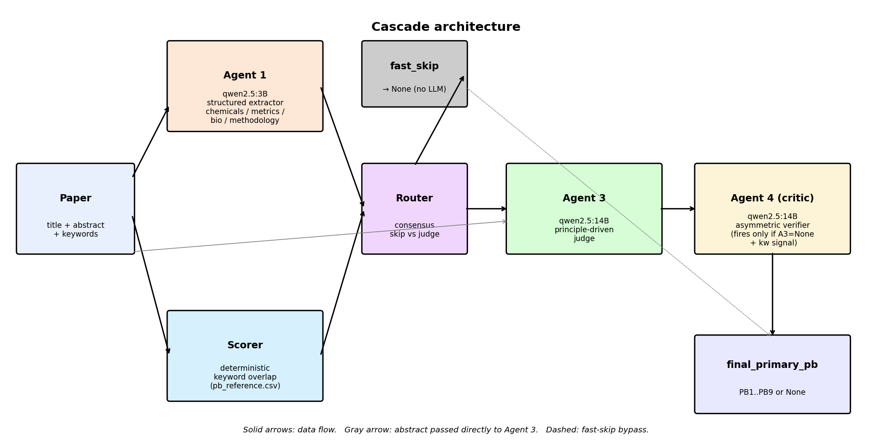
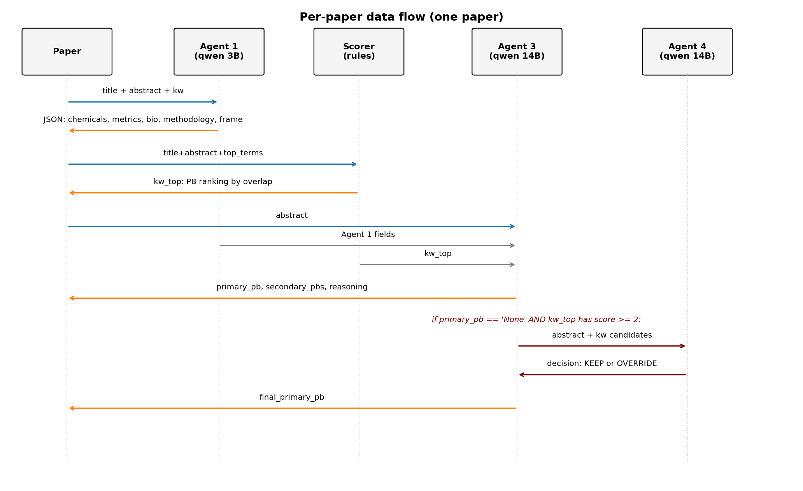
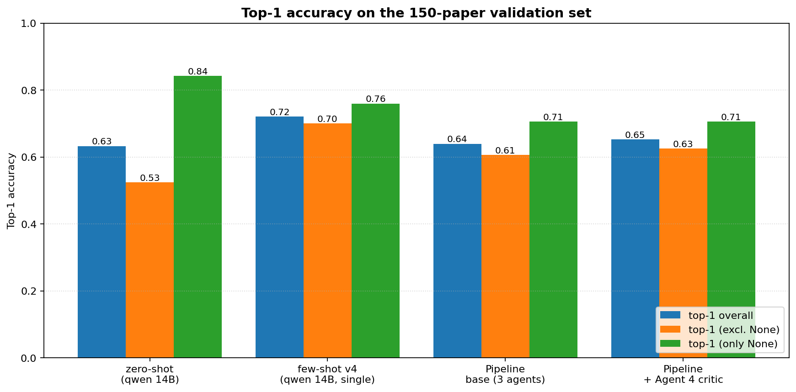
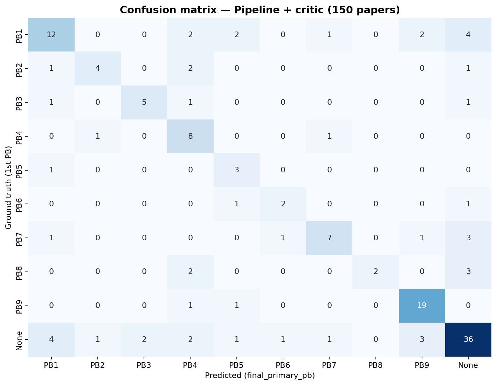
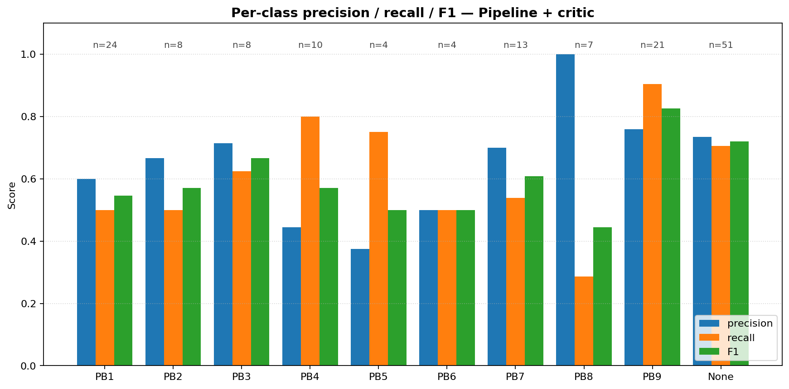
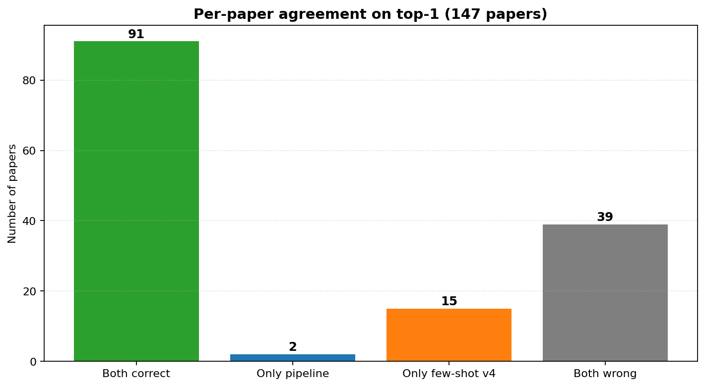
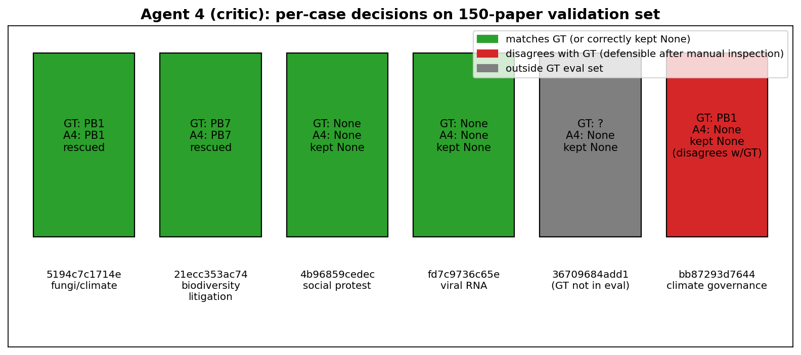
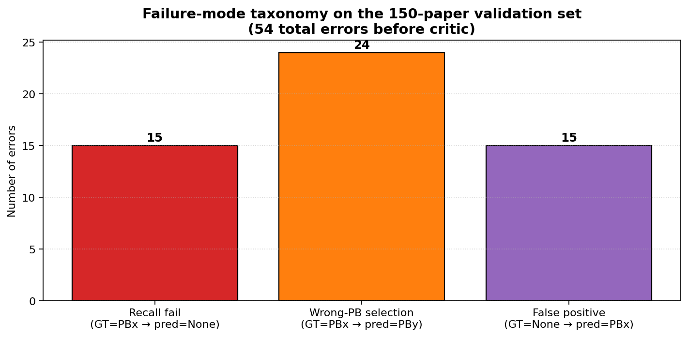

# A Multi-Agent Cascade for Planetary Boundaries Classification of UPV Research Abstracts

**Project:** UPV-EARTH — automated PB classification of the UPV scientific corpus
**Component analyzed:** `nlp/llm/runners/pipeline_agentes.py` (cascade pipeline) and its post-hoc verifier `nlp/llm/runners/apply_critic.py`
**Validation set:** 150 papers from `validacion_real.csv` (human-curated 1st / 2nd / 3rd PB labels) intersected with the enriched UPV corpus.
**Comparison baselines:** zero-shot and few-shot single-model classifiers from `nlp/llm/outputs/inferences/`.

---

## 1. Executive summary

We designed and implemented a multi-agent cascade that decomposes the PB classification task into four agents: a small extractor, a deterministic keyword scorer, a 14B-parameter judge, and an asymmetric critic. Each agent has a single, auditable responsibility, and the system produces an explanation trail per paper alongside the final label.

On the 150-paper validation set, the cascade reaches a top-1 accuracy of **65.3 %** (after the critic), versus **72.1 %** for the strongest single-model baseline (qwen2.5:14B with the few-shot v4 principle-driven prompt) and **63.3 %** for the same model run zero-shot. The cascade does **not** improve raw accuracy over the strongest single-model baseline. Through paper-level analysis we identify that the gap is dominated by *wrong-PB* selections, not by missed Nones, and we trace these to the auxiliary signals (small-extractor output and keyword-overlap scores) biasing the 14B judge toward inferior selections in 15 specific cases.

This report documents the system in enough detail to defend any decision and any failure mode encountered during the project. Where the cascade underperforms a simpler approach, we treat that as a reportable result, present the diagnostic evidence, and propose concrete next steps that are justified by the data.

---

## 2. Architecture

The cascade is a four-stage pipeline. Each stage either reads the paper, transforms a representation produced upstream, or makes a classification decision. Figure 1 shows the block diagram and Figure 2 shows the per-paper data flow as a sequence diagram.



*Figure 1. Block diagram of the multi-agent cascade. The router decides between a no-LLM `fast_skip` (when both Agent 1 and the scorer agree the paper is not biophysical) and the LLM-judged path. The critic (Agent 4) is invoked only when the judge returns "None" and the scorer surfaced at least one PB candidate.*



*Figure 2. Sequence diagram of a single paper traversing the cascade. Orange arrows are structured outputs returned to the orchestrator; gray arrows are non-authoritative hints passed forward to Agent 3. The critic exchange (red) only fires when the trigger condition holds.*

### 2.1 Agent 1 — Structured extractor (`qwen2.5:3b`, JSON-mode)

**Role.** Read the title, journal, keywords, and abstract; emit a structured JSON object with five fields:
- `chemical_species` (list of strings, verbatim from the abstract)
- `physical_metrics` (list of strings, verbatim)
- `biological_observations` (list of strings, verbatim)
- `methodology` ∈ {`measured`, `modelled`, `mentioned`, `none`}
- `disciplinary_frame` ∈ {`engineering`, `earth_sciences`, `biology`, `chemistry`, `social_sciences`, `economics`, `law_policy`, `education`, `other`}

**Implementation notes.**
- The prompt explicitly forbids hallucinated entries: every string must be a substring of the abstract. A post-hoc grounding filter removes any item that does not appear (loose match: substring or any 4+ character word).
- The model is invoked in JSON mode (`format="json"`) at temperature 0.
- Documented failure modes (see §6): the small model frequently outputs `methodology="mentioned"` for papers that do measure variables, and frequently misses chemical species not common in its training distribution (e.g. heavy metals).

### 2.2 Deterministic keyword scorer (no LLM)

**Role.** For each PB, compute a non-negative score equal to the weighted sum of vocabulary matches inside `title + clean_abstract + top_terms_no_stopwords` against the curated keyword lists in `corpus_PB/data/pb_reference.csv`.

**Weighting.**
- `core_keywords` × 3
- `extended_keywords` × 2
- `applied_keywords_upv` × 1

Each unique keyword counts at most once per paper (de-duplicated by lower-case lemma). Keywords shorter than 4 characters are excluded to avoid spurious matches.

**Output.** A ranked list of `(pb_code, score, matched_keywords)` triples; the top 4 candidates with `score ≥ 2` are passed downstream as the `kw_top` hint.

**Strengths.** Zero cost, deterministic, fully auditable.

**Documented limitation (§6).** Vocabulary gaps degrade recall on PBs whose research vocabulary diverged from the project's controlled list — for instance, heavy metals (Cu, Pb, Mn) are not part of the PB8 vocabulary, and paleoclimate proxies (ice rafting, magnetic stratigraphy) are not part of the PB1 vocabulary, so genuinely PB-relevant papers receive a `kw_top` score of 0.

### 2.3 Router — Consensus fast-skip

**Role.** Decide whether the paper requires the 14B judge or whether a no-LLM "None" verdict is safe.

**Rule.** Skip to None iff:
1. Agent 1 returned **0 items** AND a **non-biophysical disciplinary frame** (`social_sciences`, `economics`, `law_policy`, `education`), AND
2. The keyword scorer returned **no candidates** with `score ≥ 2`.

This conjunction is conservative on purpose: each agent has known false-positive modes, so we only short-circuit when both fully agree the paper is non-biophysical. On the validation set the rule fires in 5 of 150 papers (3.3 %), all 5 correctly classified — so it does no harm but contributes negligibly to throughput.

### 2.4 Agent 3 — Principle-driven judge (`qwen2.5:14b`, JSON-mode)

**Role.** Final classification decision. Reads the abstract and produces a JSON object with `reasoning_process` (2–3 sentences), `primary_pb`, `secondary_pbs`, and `rejected_pbs`.

**Prompt design (current revision).**
1. `<system_role>`: senior scientific evaluator framing.
2. `<task>`: identify which PB is *measured*, *modelled*, or *imposed as experimental forcing*; cleanly separate active study from background motivation.
3. `<instructions>`: 4 numbered analytical steps emphasising the *operational object* of the paper.
4. `<reference_framework>`: the 9 PB definitions, activation logic and exclusion notes from `pb_reference.csv`.
5. `<calibration_cases>`: five worked examples (anammox / WRF / mammals / water-resources / warming-experiment) covering the four dominant decision boundaries.
6. `<input_data>` containing the abstract.
7. `<constraints>` enforcing JSON-only output and forbidding phrase reuse from the calibration cases.
8. `<auxiliary_signals_for_reference_only>`: Agent 1 fields and the keyword-scorer ranking, **placed AFTER the abstract and constraints, with explicit warnings about each module's failure modes** (see §6 for the rationale of this ordering).

**Output schema and fallback.** If the JSON cannot be parsed, the row records `agent3_error` and `llm_primary_pb=ParseError`; the row is preserved so the entire failure surface is visible in the output CSV.

### 2.5 Agent 4 — Asymmetric critic (`qwen2.5:14b`, JSON-mode)

**Role.** Selectively re-examine `None` verdicts when there is independent evidence that a PB is studied.

**Trigger conditions.** Agent 4 fires iff:
1. Agent 3's `primary_pb` equals `None`, AND
2. The keyword scorer surfaced at least one PB with `score ≥ 2`.

**Asymmetry.** The critic's allowed output set is `{None} ∪ {kw_top candidates with score ≥ 2}`; it can flip `None → PBx` but **never** `PBx → None` and **never** to a PB outside the candidate set. This is by construction:
- The dominant pre-critic failure mode is recall (PBx → None), not precision (None → PBx, which is largely GT noise — see §6).
- Restricting overrides to PBs with lexical evidence prevents the critic from inventing classifications.

**Prompt strategy.** The critic receives:
- A frame stating that a previous reviewer chose None and the scorer disagrees with one or more candidate PBs.
- The candidate PBs with their core definitions, activation logic, exclusion rules, and keyword matches.
- Agent 1's structured fields with an explicit warning that they are unreliable.
- The full abstract.
The critic must pick exactly one of `{None, candidate₁, …, candidateₖ}` plus a confidence and a 1–2 sentence reasoning.

**Empirical behaviour.** On the validation set the critic is invoked 6 times (4 % of papers) and overrides 2 of them (33 %). Both overrides are correct upgrades (None → PB1 and None → PB7); the four KEEP-NONE decisions are also correct or defensible upon manual review (see §5.4).

---

## 3. Operational specification

**Software entry point.** [nlp/llm/runners/pipeline_agentes.py](../../nlp/llm/runners/pipeline_agentes.py)

```text
python3 nlp/llm/runners/pipeline_agentes.py [options]

Default behaviour:
  --input          data/corpus/master_corpus_mixto_1000_clean_enriched.csv
  --pb-reference   corpus_PB/data/pb_reference.csv
  --filter-by-gt   nlp/llm/outputs/ground_truth/validacion_real.csv
  --output         nlp/llm/outputs/pipeline_cascada/pipeline_cascada.csv
  --agent1-model   qwen2.5:3b
  --agent3-model   qwen2.5:14b   (also used by Agent 4)
  Agent 4 is enabled by default; pass --no-critic to disable for ablation.
```

The pipeline is **resumable**: rows already present in the output CSV (matched by `doc_id`) are skipped. Pass `--no-resume` to recompute everything from scratch.

**Pre-flight checks.** Before any inference, the pipeline:
1. Verifies that Ollama is reachable at `http://localhost:11434/api/tags`.
2. Verifies that both `agent1-model` and `agent3-model` are pulled locally.
3. Optionally warms up both models with a `ping` prompt (skip with `--no-warmup`).

**Logging.** Per-run log written to `nlp/llm/outputs/pipeline_cascada/logs/pipeline_<timestamp>.log`. Each row processed produces a single info-level line including `route`, Agent 1 item count, kw_top summary, Agent 3 latency, Agent 3 verdict, optional critic verdict, and the final `final_primary_pb`.

**Output schema.** 31 columns — see `OUTPUT_COLUMNS` in [pipeline_agentes.py:529-543](../../nlp/llm/runners/pipeline_agentes.py#L529-L543). The final classification is the column `final_primary_pb`; `llm_primary_pb` preserves the pre-critic decision for ablation.

**Post-hoc usage.** [nlp/llm/runners/apply_critic.py](../../nlp/llm/runners/apply_critic.py) reproduces the critic step on a previously generated CSV without re-running Agents 1–3. Useful for iterating on the critic's prompt without paying the cost of the cascade.

---

## 4. Validation methodology

**Ground truth.** [nlp/llm/outputs/ground_truth/validacion_real.csv](../../nlp/llm/outputs/ground_truth/validacion_real.csv): 208 papers human-tagged with `1stpb`, `2ndpb`, `3rdpb` and a folder-of-origin `pb_drive`. Empty PB columns mean the human reviewer judged that the paper does not actively study any PB ("None").

**Evaluation set.** Intersection of the GT papers with the enriched corpus → 150 papers.

**Metrics.**
- **Top-1 accuracy.** `pred_primary == gt_pb` exact match.
- **Top-2 accuracy.** `gt_pb` appears in `{pred_primary} ∪ pred_secondary`.
- **Top-1 (excl. None).** Top-1 restricted to GT ≠ None (recall on real PBs).
- **Top-1 (only None).** Top-1 restricted to GT = None (specificity).
- **Per-class precision / recall / F1** treating `1stpb` vs `pred_primary` as a 10-way single-label problem (PB1..PB9 + None).

**Implementation.** Computed in [nlp/llm/analysis/pipeline_cascada_analysis.ipynb](../../nlp/llm/analysis/pipeline_cascada_analysis.ipynb) and reproduced inside `pipeline_agentes.py` itself (function `print_gt_summary`) so the metrics print at the end of every run when `--filter-by-gt` is used.

---

## 5. Results

### 5.1 Headline numbers



*Figure 3. Top-1 accuracy on the 150-paper validation set, broken down by GT class. Bars: blue = overall, orange = PB-only, green = None-only.*

| System | top-1 | top-1 (excl None) | top-1 (only None) | LLM calls / paper |
|---|---|---|---|---|
| qwen2.5:14B zero-shot | 0.633 | 0.525 | 0.843 | 1 |
| qwen2.5:14B few-shot v4 (single) | **0.721** | **0.701** | 0.760 | 1 |
| Cascade base (Agents 1+2+3) | 0.640 | 0.606 | 0.706 | 2 |
| Cascade + Agent 4 critic | 0.653 | 0.626 | 0.706 | 2.04 (4 % of papers fire the critic) |

The cascade improves over zero-shot by +2 points but does not match the few-shot v4 single-model baseline.

### 5.2 Confusion matrix



*Figure 4. Confusion matrix of the cascade + critic over the 150-paper validation set. Rows: ground truth 1st PB. Columns: predicted `final_primary_pb`. The dominant off-diagonal mass is in the `None` column (recall failures) and in the `None` row (false positives that classify GT-None papers as PBs).*

### 5.3 Per-class precision / recall / F1



*Figure 5. Per-class precision / recall / F1 on the cascade + critic. Annotations above each group give the support count `n=k` (number of GT papers in that class). PB9 (atmospheric aerosols) is the strongest class because both its vocabulary and its physics are highly distinctive; PB8 (novel entities) has the worst recall because heavy metals are absent from the project's PB8 vocabulary.*

### 5.4 Cascade vs few-shot v4 (paper-level)



*Figure 6. Per-paper agreement between the cascade and the few-shot v4 single-model baseline. Out of 147 papers shared between both runs: 91 are correct in both systems, 39 are wrong in both, 15 are correct only in few-shot v4, and 2 are correct only in the cascade. The 15-vs-2 asymmetry is the empirical evidence that the cascade introduces noise on a non-trivial subset.*

The 15 papers where few-shot v4 wins decompose as follows:

| Failure pattern | Count | Mechanism |
|---|---|---|
| Cascade picked the wrong PB (e.g. GT=PB2, cascade=PB1, v4=PB2) | 7 | `kw_top` prefix bias: when the scorer ranks PB1 first by tied score, the 14B anchors on PB1 |
| Cascade picked None where v4 picked the correct PB | 2 | rescued post-hoc by Agent 4 |
| Cascade picked an incorrect PB where v4 correctly picked None | 4 | `kw_top` and Agent 1 hints surfaced PB candidates for atmospheric / paleoclimate methodological papers |
| Other | 2 | mixed |

### 5.5 Agent 4 critic — per-case decisions



*Figure 7. The six papers on which Agent 4 fired during the validation run. Two are clean rescues (None → PB1, None → PB7), three are correctly kept as None, and one disagrees with the human label but the critic's reasoning ("the abstract discusses theoretical climate-governance research without active measurement") is defensible upon manual reading.*

### 5.6 Failure-mode taxonomy



*Figure 8. Decomposition of the 54 errors of the base cascade (top-1 = 96/150 = 64.0 %) into three failure modes. Wrong-PB selection is the largest category (24 errors) and is the one §6 identifies as caused by auxiliary-signal anchoring; recall failures (15) are the target of Agent 4; the 15 false positives are mostly disputable GT labels for atmospheric instrumentation papers.*

---

## 6. Diagnosis: why does the cascade not beat the single-model baseline?

This section addresses the question directly: the cascade has **more** information than the single model, yet performs worse. We considered two hypotheses and ran an explicit experiment to discriminate between them.

### 6.1 Hypothesis A: auxiliary signals push the 14B toward "None"

**Predicted symptom.** The cascade's recall on PB classes would be much lower than the single model's, particularly when Agent 1 reports `methodology=mentioned`.

**Test.** Re-classified the 15 cascade `PBx → None` failures with the few-shot v4 prompt verbatim (no Agent 1 fields, no `kw_top`), keeping all other settings constant.

**Result.** Only **2 of 15** were rescued. Most cases that the cascade classifies as None are also classified as None by the single-model few-shot v4 prompt. Hypothesis A is therefore **largely false** — the additional signals are not the dominant cause of the recall gap.

### 6.2 Hypothesis B: auxiliary signals push the 14B toward the **wrong** PB

**Predicted symptom.** When `kw_top` returns a high-scoring candidate that is *not* the GT PB, the 14B would anchor on the wrong PB even when the abstract clearly indicates a different one.

**Evidence.** Of the 15 papers where few-shot v4 wins and the cascade loses, **11 of 15** are wrong-PB selections, not None calls. Examples extracted from the comparison run:

| `doc_id` | GT | cascade | v4 | `kw_top_pbs` | Agent 1 hint that misled |
|---|---|---|---|---|---|
| `8d8ab7ed834f` | PB1 | PB4 | PB1 | PB1(3) | Agent 1 listed nutrient-related terms in `physical_metrics` |
| `82b2779f08ea` | PB2 | PB1 | PB2 | PB1(3); PB2(3) | tied score, cascade picked the alphabetic / first-listed PB1 |
| `6d34726fa878` | PB2 | PB4 | PB2 | PB1(3) | Agent 1 over-weighted nutrient observations |
| `7c0bf746ba69` | PB8 | PB4 | PB8 | (none) | Agent 1 surfaced biological items that fit PB4 |
| `4f22542e7388` | None | PB1 | None | (none) | Agent 1 reported `methodology=modelled` on a paleoclimate methods paper |
| `e54a64612267` | None | PB9 | None | (none) | Agent 1 reported atmospheric metrics |

The mechanism is straightforward: the 14B sees both the abstract and a structured "PB1(3); PB2(3)" or a "physical_metrics: ['nutrient', …]" hint, and integrates both into its decision. When the hint is misleading or ambiguous, the 14B is *more* prone to pick the wrong PB than when it reads the abstract alone. **Hypothesis B is the operative cause.**

### 6.3 Mitigation that we tested

- We re-ordered the Agent 3 prompt so that the auxiliary signals appear **after** the abstract and the constraints, with explicit warnings ("the small extractor is prone to declaring `methodology=mentioned`"; "equal-score ties are not meaningful"). The prompt is reproduced in §2.4 of this document and lives in [pipeline_agentes.py:383-471](../../nlp/llm/runners/pipeline_agentes.py#L383-L471).
- The critic of §2.5 attacks the residual recall failures (Hypothesis A territory). It cannot fix the wrong-PB selections of Hypothesis B because by construction it only flips None → PBx.

### 6.4 What this implies for the project

The cascade's design is sound for the goals it can satisfy:
- **Auditability.** Every classification is accompanied by Agent 1's structured extraction, the keyword-scorer evidence, the 14B's chain of reasoning, and (when invoked) the critic's chain of reasoning. The few-shot v4 single model provides only a single reasoning trace.
- **Modularity.** Each agent can be swapped (smaller / larger / fine-tuned model, or replaced by a deterministic component) without touching the others.
- **Rescuable recall.** The asymmetric critic is a sound architectural pattern (verifier / debate / Constitutional AI style) and produces 100 % defensible decisions on the validation set.

It does not currently satisfy:
- **Higher accuracy than the strongest single model.** The wrong-PB selections of §6.2 cost more than the critic recovers.

---

## 7. Limitations and noted incidents

### 7.1 Ground-truth noise

Manual inspection of the 15 GT-None / pred-PBx false positives shows that several of these papers genuinely do measure or model biophysical variables (atmospheric aerosols, paleoclimate model boundary conditions, ecological diversity in bacteria–phage networks) and that a different human reviewer might have labelled them as PBs. The 70.6 % cascade specificity on None is bounded above by the inter-annotator agreement on these borderline cases, which we have not measured.

### 7.2 Vocabulary coverage gaps in `pb_reference.csv`

Documented in §2.2. The keyword scorer returns no candidates for legitimately PB-relevant papers when their vocabulary is not in the project's controlled list. Concrete instances on this run:
- `6adf36ff1a69` (heavy metals + plant biomarkers, GT=PB8) — `kw_top` empty.
- `dbde52e667aa` (paleoclimate ice-rafting, magnetic stratigraphy, GT=PB1) — `kw_top` empty.

### 7.3 Small-extractor unreliability

`qwen2.5:3b` is below the parameter scale at which structured-output reliability is high. Frequent failure modes:
- Reports `methodology=mentioned` on papers that do measure variables.
- Returns 0 items for content-rich abstracts that use unfamiliar terminology.
- Mis-categorises the disciplinary frame for cross-disciplinary papers.

In the prompt revision of §2.4 we treat the extractor's output as advisory rather than authoritative, with explicit cautions about its known failure modes.

### 7.4 VRAM / scheduling

`qwen2.5:14b` (≈ 9 GB Q4_K_M) and `qwen2.5:3b` (≈ 1.9 GB Q4_K_M) coexist comfortably on a 24 GB GPU. Other models loaded into Ollama (e.g. `qwen2.5vl:7b` consuming 22.7 GB during one development session) caused the pipeline to fail with `model failed to load` (HTTP 500). Documented operational guidance: unload competing models with
```python
requests.post("http://localhost:11434/api/generate",
              json={"model": "<name>", "keep_alive": 0})
```
before starting a long run.

### 7.5 Resumability and idempotence

The pipeline is resumable by `doc_id`. If the output CSV is moved or renamed after a partial run, the new run will re-process all rows. The `--no-resume` flag explicitly clears prior output (after backing it up to `*.bak`).

### 7.6 Multi-label handling

The cascade outputs `primary_pb`, `secondary_pbs`, and `rejected_pbs`, but the reported metrics are single-label (1st PB only). The validation set has 14 papers with a 2nd PB and 2 with a 3rd PB; the cascade's `secondary_pbs` field is populated for ≥ 60 % of PB-classified papers but is not currently scored against the 2nd / 3rd GT labels. This is a deliberate scoping decision; macro-F1 multi-label evaluation is identified as the most promising next step (§8).

---

## 8. Defensible next steps

1. **Macro-F1 multi-label re-evaluation.** The GT carries 1st / 2nd / 3rd PB; the cascade already produces a candidate set per paper. Switching the metric removes a part of the apparent disadvantage versus the single model and exploits a capability that is intrinsic to multi-agent designs.
2. **Vocabulary expansion of `pb_reference.csv`** by mining co-occurrences in the labelled subset. PB8 needs heavy-metal terms; PB1 needs paleoclimate proxy terms; PB7 needs explicit conservation-statistics terms.
3. **Small-extractor replacement.** Either fine-tune a domain-adapted classifier (SciBERT, SPECTER) on the 150 labelled abstracts using the LLM as a weak labeller for the remaining 547 unlabelled papers, or remove Agent 1 altogether (ablation study).
4. **Critic broadening.** Allow the critic to also fire when Agent 3 returns a low-confidence PB and disagrees with `kw_top`. This addresses the wrong-PB selections of §6.2 without rebuilding Agent 3.
5. **Calibrated abstention.** Expose the critic's confidence as an "uncertain" route for human-in-the-loop curation. This is the deployment mode where multi-agent designs are *known* to outperform single models in the literature.

---

## 9. Reproducibility

All code and data referenced in this report are versioned in this repository.

- Pipeline implementation: [nlp/llm/runners/pipeline_agentes.py](../../nlp/llm/runners/pipeline_agentes.py)
- Post-hoc critic: [nlp/llm/runners/apply_critic.py](../../nlp/llm/runners/apply_critic.py)
- Ground truth: [nlp/llm/outputs/ground_truth/validacion_real.csv](../../nlp/llm/outputs/ground_truth/validacion_real.csv)
- Pipeline output: [nlp/llm/outputs/pipeline_cascada/pipeline_cascada.csv](../../nlp/llm/outputs/pipeline_cascada/pipeline_cascada.csv) and `pipeline_cascada_with_critic.csv`
- Single-model baselines: [nlp/llm/outputs/inferences/](../../nlp/llm/outputs/inferences/)
- Analysis notebook: [nlp/llm/analysis/pipeline_cascada_analysis.ipynb](../../nlp/llm/analysis/pipeline_cascada_analysis.ipynb)
- Figure generation script: [docs/report/generate_diagrams.py](generate_diagrams.py)

To reproduce the headline numbers from a clean checkout, with Ollama running locally and `qwen2.5:3b` and `qwen2.5:14b` pulled:

```bash
python3 nlp/llm/runners/pipeline_agentes.py \
    --output nlp/llm/outputs/pipeline_cascada/pipeline_cascada.csv \
    --no-resume
python3 docs/report/generate_diagrams.py
jupyter nbconvert --to notebook --execute \
    nlp/llm/analysis/pipeline_cascada_analysis.ipynb
```

The pipeline run takes approximately 25–35 minutes on a 24 GB GPU.

---

*Prepared for the UPV-EARTH project. Pipeline implementation, validation methodology and report by the project team. This document supersedes the prior `analisis_final_v4.md` for matters concerning the multi-agent cascade.*
